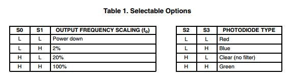

# Color sensor

https://www.hackster.io/MakerRobotics/color-sensor-gy-31-6b5f75

Требует чёртову прорву пинов, зато работает.

На самом деле достаточно подцепить S2, S3, out, а S0, S1, LED замкнуть
на ground/ioref по вкусу.




## WTF FREQ. SCALING?

Просто множитель значений.

LED ON, S0 high, S1 high:

```
RED 145 GREEN 612 BLUE 449
RED 153 GREEN 619 BLUE 451
RED 151 GREEN 619 BLUE 447
```

LED ON, S0 high, S1 low:

```
RED 752 GREEN 3095 BLUE 2243
RED 756 GREEN 3089 BLUE 2241
RED 760 GREEN 3103 BLUE 2246
```

LED ON, S0 low, S1 high:

```
RED 7507 GREEN 30874 BLUE 22425
RED 7509 GREEN 30885 BLUE 22420
RED 7513 GREEN 30891 BLUE 22433
```

LED OFF, S0 high, S1 high:

```
RED 415 GREEN 2083 BLUE 1738
RED 423 GREEN 2095 BLUE 1772
RED 422 GREEN 2071 BLUE 1738
```

