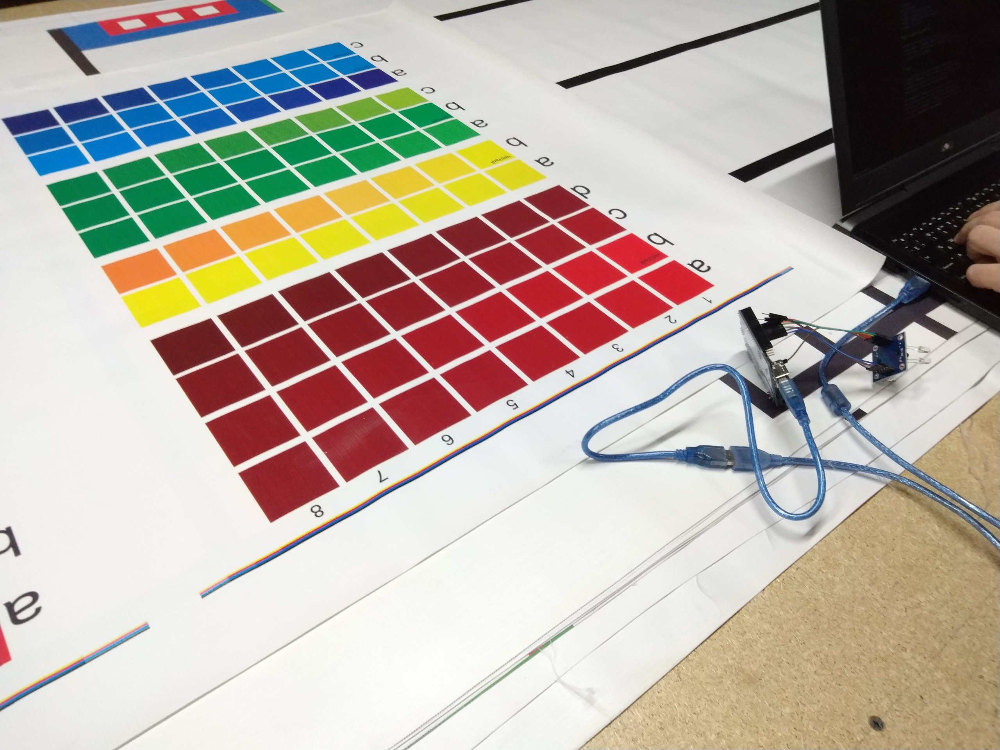

# День -1: 2019-01-07

Прочитана матчасть. Можно что-то пробовать.

# День 0: 2019-01-08

@mastersin предлагает соревноваться. Взял каких-то железок со стола и заявился.

# День 1: 2019-01-10

Завёл репозиторий для заметок (этот вот).

Игрался с PC-speaker'ом, теперь он играет Shut Your Mouth.
Будет круто, если на него хватит ноги и таймера.

TODO: выложить видео.

# День 2: 2019-01-11

Был в Скушном Месте. Набрал ещё деталей, теперь наверное
смогу всё смонтировать.

Тестировали датчик цвета -- работает неплохо.

# День 3: 2019-01-12

Надел motor shield на ардуину и тестировал движки. При питании от
USB тока предсказуемо не хватает на оба. Нашёл блок питания от
старого роутера с подходящим разьёмом (12V, 1.5A) -- с ним
движки просто летают. За секунду ~1.4м на максимальной скорости.

Такая скорость точно не очень нужна. Есть ли колёса поменьше?
